# EntityFramework-MVC-CRUD-example-1.3

# 0. Instalar los paquetes NuGets necesarios en ambos proyectos

- Microsoft.EntityFrameworkCore
- Microsoft.EntityFrameworkCore.Design
- Microsoft.EntityFrameworkCore.Relational
- Microsoft.EntityFrameworkCore.Tools
- Npgsql.EntityFrameworkCore.PostgreSQL

# 1. Data Access Layer (DAL)

## 1.1. Crear una *Biblioteca de Clases de tipo Standar*

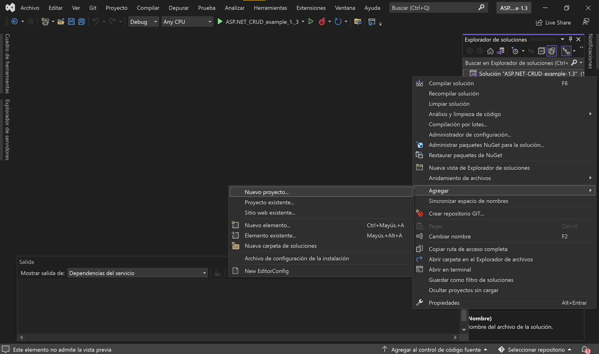

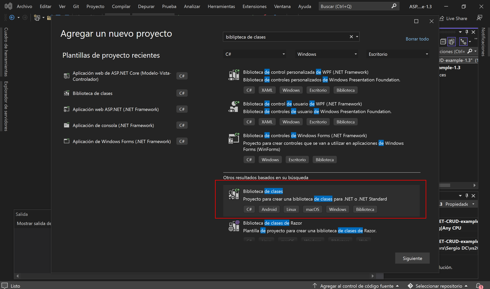

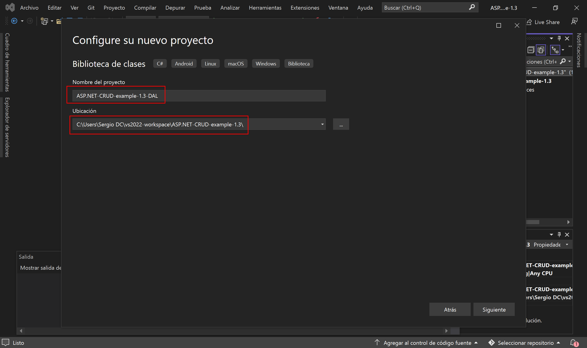

## 1.2. Referenciar el proyecto con la biblioteca de clases

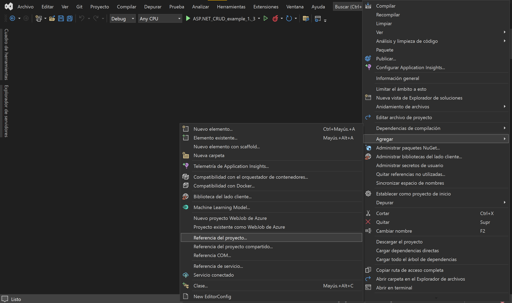

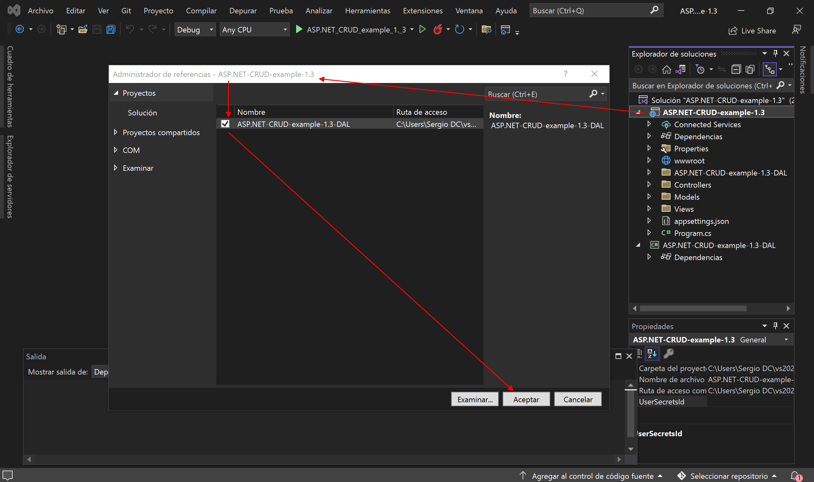

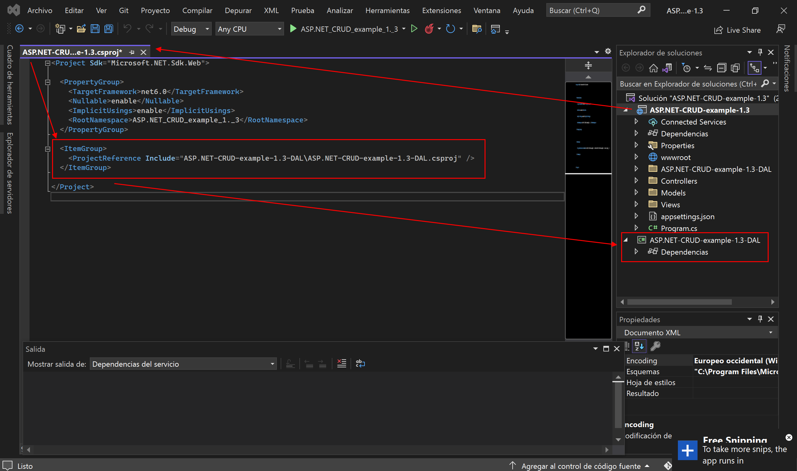

## 1.3. Creamos la clase *Models.cs*

```csharp
namespace ASP.NET_CRUD_example_1._3_DAL
{
    public class Alumno
    {
        public int Id { get; set; }
        public string AlumnoNombre { get; set; }
        public string AlumnoApellidos { get; set; }
        public string AlumnoEmail { get; set; }

        public List<Asignatura>? ListaAsignaturas { get; set; }
    }

    public class Asignatura
    {
        public int Id { get; set; }
        public string AsignaturaNombre { get; set; }

        public List<Alumno>? ListaAlumnos { get; set; }
    }
}
```

El objetivo de estos dos modelos es que, sus listas serán sus Foreign Keys, las cuales establecen una relación de *many-to-many*, y así se autocreará una tercera entidad que será la tabla relacional entre ambos modelos.

## 1.4. *PostgreSqlContext.cs*

```csharp
using Microsoft.EntityFrameworkCore;

namespace ASP.NET_CRUD_example_1._3_DAL
{
    public class PostgreSqlContext : DbContext
    {
        public PostgreSqlContext(DbContextOptions<PostgreSqlContext> options)
               : base(options)
        { }

        protected override void OnModelCreating(ModelBuilder modelBuilder)
        {
            modelBuilder.UseSerialColumns();
        }

        public DbSet<Alumno>? Alumnos { get; set; }
        public DbSet<Asignatura>? Asignaturas { get; set; }
    }
}
```

# 2. Establecemos la conexión con la BBDD

## 2.1. *appsettings.json*

```json
{
  "Logging": {
    "LogLevel": {
      "Default": "Information",
      "Microsoft.AspNetCore": "Warning"
    }
  },
  "AllowedHosts": "*",
  "ConnectionStrings": {
    "PostgreSqlConnection": "Host=localhost;Port=5432;Pooling=true;Database=asp.net-crud-example-1.3;UserId=postgres;Password=12345;"
  }
}
```

## 2.2. *Program.cs*

```csharp
using ASP.NET_CRUD_example_1._3_DAL;
using Microsoft.EntityFrameworkCore;

var builder = WebApplication.CreateBuilder(args);

// Add services to the container.
builder.Services.AddControllersWithViews();

// Añadimos nuestra conexión a la BBDD de PostgreSQL
builder.Services.AddEntityFrameworkNpgsql()
    .AddDbContext<PostgreSqlContext>(options =>
    {
        options.UseNpgsql(builder.Configuration.GetConnectionString("PostgreSqlConnection"));
    });

var app = builder.Build();

// Configure the HTTP request pipeline.
if (!app.Environment.IsDevelopment())
{
    app.UseExceptionHandler("/Home/Error");
    // The default HSTS value is 30 days. You may want to change this for production scenarios, see https://aka.ms/aspnetcore-hsts.
    app.UseHsts();
}

app.UseHttpsRedirection();
app.UseStaticFiles();

app.UseRouting();

app.UseAuthorization();

app.MapControllerRoute(
    name: "default",
    pattern: "{controller=Home}/{action=Index}/{id?}");

app.Run();
```

# 3. Migration

Abrimos una nueva consola administradora de paquetes NuGets, y seleccionamos utilzarla en la biblioteca de clases (no en el proyecto en sí).

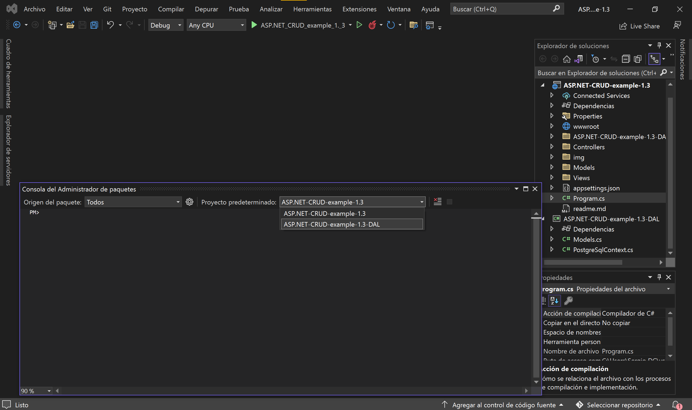

Como siempre, ejecutamos los comandos de:

- `Add-Migration prueba-migracion-1 -Context PostgreSqlContext`
- `Update-database -Context PostgreSqlContext`

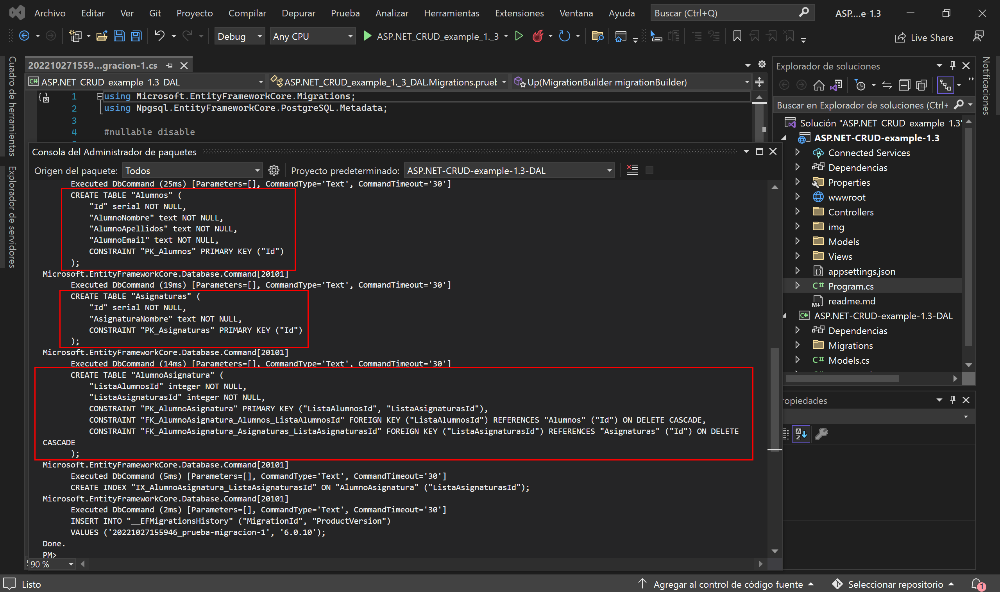

## 3.1. *prueba-migracion-1.cs*

```csharp
using Microsoft.EntityFrameworkCore.Migrations;
using Npgsql.EntityFrameworkCore.PostgreSQL.Metadata;

#nullable disable

namespace ASP.NET_CRUD_example_1._3_DAL.Migrations
{
    public partial class pruebamigracion1 : Migration
    {
        protected override void Up(MigrationBuilder migrationBuilder)
        {
            migrationBuilder.CreateTable(
                name: "Alumnos",
                columns: table => new
                {
                    Id = table.Column<int>(type: "integer", nullable: false)
                        .Annotation("Npgsql:ValueGenerationStrategy", NpgsqlValueGenerationStrategy.SerialColumn),
                    AlumnoNombre = table.Column<string>(type: "text", nullable: false),
                    AlumnoApellidos = table.Column<string>(type: "text", nullable: false),
                    AlumnoEmail = table.Column<string>(type: "text", nullable: false)
                },
                constraints: table =>
                {
                    table.PrimaryKey("PK_Alumnos", x => x.Id);
                });

            migrationBuilder.CreateTable(
                name: "Asignaturas",
                columns: table => new
                {
                    Id = table.Column<int>(type: "integer", nullable: false)
                        .Annotation("Npgsql:ValueGenerationStrategy", NpgsqlValueGenerationStrategy.SerialColumn),
                    AsignaturaNombre = table.Column<string>(type: "text", nullable: false)
                },
                constraints: table =>
                {
                    table.PrimaryKey("PK_Asignaturas", x => x.Id);
                });

            migrationBuilder.CreateTable(
                name: "AlumnoAsignatura",
                columns: table => new
                {
                    ListaAlumnosId = table.Column<int>(type: "integer", nullable: false),
                    ListaAsignaturasId = table.Column<int>(type: "integer", nullable: false)
                },
                constraints: table =>
                {
                    table.PrimaryKey("PK_AlumnoAsignatura", x => new { x.ListaAlumnosId, x.ListaAsignaturasId });
                    table.ForeignKey(
                        name: "FK_AlumnoAsignatura_Alumnos_ListaAlumnosId",
                        column: x => x.ListaAlumnosId,
                        principalTable: "Alumnos",
                        principalColumn: "Id",
                        onDelete: ReferentialAction.Cascade);
                    table.ForeignKey(
                        name: "FK_AlumnoAsignatura_Asignaturas_ListaAsignaturasId",
                        column: x => x.ListaAsignaturasId,
                        principalTable: "Asignaturas",
                        principalColumn: "Id",
                        onDelete: ReferentialAction.Cascade);
                });

            migrationBuilder.CreateIndex(
                name: "IX_AlumnoAsignatura_ListaAsignaturasId",
                table: "AlumnoAsignatura",
                column: "ListaAsignaturasId");
        }

        protected override void Down(MigrationBuilder migrationBuilder)
        {
            migrationBuilder.DropTable(
                name: "AlumnoAsignatura");

            migrationBuilder.DropTable(
                name: "Alumnos");

            migrationBuilder.DropTable(
                name: "Asignaturas");
        }
    }
}
```

## 3.2. *prueba-migracion-1.Designer.cs*

```csharp
// <auto-generated />
using ASP.NET_CRUD_example_1._3_DAL;
using Microsoft.EntityFrameworkCore;
using Microsoft.EntityFrameworkCore.Infrastructure;
using Microsoft.EntityFrameworkCore.Migrations;
using Microsoft.EntityFrameworkCore.Storage.ValueConversion;
using Npgsql.EntityFrameworkCore.PostgreSQL.Metadata;

#nullable disable

namespace ASP.NET_CRUD_example_1._3_DAL.Migrations
{
    [DbContext(typeof(PostgreSqlContext))]
    [Migration("20221027155946_prueba-migracion-1")]
    partial class pruebamigracion1
    {
        protected override void BuildTargetModel(ModelBuilder modelBuilder)
        {
#pragma warning disable 612, 618
            modelBuilder
                .HasAnnotation("ProductVersion", "6.0.10")
                .HasAnnotation("Relational:MaxIdentifierLength", 63);

            NpgsqlModelBuilderExtensions.UseSerialColumns(modelBuilder);

            modelBuilder.Entity("AlumnoAsignatura", b =>
                {
                    b.Property<int>("ListaAlumnosId")
                        .HasColumnType("integer");

                    b.Property<int>("ListaAsignaturasId")
                        .HasColumnType("integer");

                    b.HasKey("ListaAlumnosId", "ListaAsignaturasId");

                    b.HasIndex("ListaAsignaturasId");

                    b.ToTable("AlumnoAsignatura");
                });

            modelBuilder.Entity("ASP.NET_CRUD_example_1._3_DAL.Alumno", b =>
                {
                    b.Property<int>("Id")
                        .ValueGeneratedOnAdd()
                        .HasColumnType("integer");

                    NpgsqlPropertyBuilderExtensions.UseSerialColumn(b.Property<int>("Id"));

                    b.Property<string>("AlumnoApellidos")
                        .IsRequired()
                        .HasColumnType("text");

                    b.Property<string>("AlumnoEmail")
                        .IsRequired()
                        .HasColumnType("text");

                    b.Property<string>("AlumnoNombre")
                        .IsRequired()
                        .HasColumnType("text");

                    b.HasKey("Id");

                    b.ToTable("Alumnos");
                });

            modelBuilder.Entity("ASP.NET_CRUD_example_1._3_DAL.Asignatura", b =>
                {
                    b.Property<int>("Id")
                        .ValueGeneratedOnAdd()
                        .HasColumnType("integer");

                    NpgsqlPropertyBuilderExtensions.UseSerialColumn(b.Property<int>("Id"));

                    b.Property<string>("AsignaturaNombre")
                        .IsRequired()
                        .HasColumnType("text");

                    b.HasKey("Id");

                    b.ToTable("Asignaturas");
                });

            modelBuilder.Entity("AlumnoAsignatura", b =>
                {
                    b.HasOne("ASP.NET_CRUD_example_1._3_DAL.Alumno", null)
                        .WithMany()
                        .HasForeignKey("ListaAlumnosId")
                        .OnDelete(DeleteBehavior.Cascade)
                        .IsRequired();

                    b.HasOne("ASP.NET_CRUD_example_1._3_DAL.Asignatura", null)
                        .WithMany()
                        .HasForeignKey("ListaAsignaturasId")
                        .OnDelete(DeleteBehavior.Cascade)
                        .IsRequired();
                });
#pragma warning restore 612, 618
        }
    }
}
```

# 4. *AsignaturaController.cs*

Creamos un controlador Razor en blanco (vacío, sin contenido predefinido)

```csharp
using ASP.NET_CRUD_example_1._3_DAL;
using Microsoft.AspNetCore.Mvc;
using Microsoft.EntityFrameworkCore;
using ASP.NET_CRUD_example_1._3.Models;

namespace ASP.NET_CRUD_example_1._3.Controllers
{
    public class AsignaturaController : Controller
    {
        private readonly PostgreSqlContext context;

        public AsignaturaController(PostgreSqlContext context)
        {
            this.context = context;
        }

        public IActionResult Index()
        {
            var asignaturas = this.context.Asignaturas.Include(asig => asig.ListaAlumnos).Select(asig => new AsignaturaViewModel
            {
                AsignaturaNombre = asig.AsignaturaNombre,
                ListaAlumnos = String.Join(',', asig.ListaAlumnos.Select(alum =>"\n" + alum.Id + ".\t" + alum.AlumnoNombre + " " + alum.AlumnoApellidos + " --> " + alum.AlumnoEmail + "\n")),
            });

            return View(asignaturas);
        }
    }
}
```

# 5. *AsignaturaViewModel.cs*

Creamos un modelo para los campos de Asignatura que pretendemos presentar en la vista (este modelo ya iría en la carpeta *Models* del proyecto principal)

```csharp
using ASP.NET_CRUD_example_1._3_DAL;

namespace ASP.NET_CRUD_example_1._3.Models
{
    public class AsignaturaViewModel
    {
        public string AsignaturaNombre { get; set; }
        public string ListaAlumnos { get; set; }
    }
}
```

# 6. La vista *Asignatura --> Index.cshtml*

```csharp
@model IEnumerable<ASP.NET_CRUD_example_1._3.Models.AsignaturaViewModel>

@{
    ViewData["Title"] = "Home Page";
}

@foreach(var asignatura in Model){
    <h1>@asignatura.AsignaturaNombre</h1>
    <p>@asignatura.ListaAlumnos</p>
}
```

# 7. Insertar datos

Para insertar unos datos de prueba, vamos a crear una nueva clase llamada *DataSeeder.cs* en la cual crearemos un método para la insercción de unos cuantos alumnos para cada asignatura.

```csharp
using ASP.NET_CRUD_example_1._3_DAL;

namespace ASP.NET_CRUD_example_1._3.Data
{
    public static class DataSeeder
    {
        public static void Seed(this IHost host)
        {
            using var scope = host.Services.CreateScope();
            using var context = scope.ServiceProvider.GetRequiredService<PostgreSqlContext>();

            context.Database.EnsureCreated();
            AddAsignaturas(context);
        }

        private static void AddAsignaturas(PostgreSqlContext context)
        {
            var asignatura = context.Asignaturas.FirstOrDefault();

            if (asignatura != null)
                return;

            context.Asignaturas.Add
                (
                    new Asignatura
                    {
                        AsignaturaNombre = "angular",
                        ListaAlumnos = new List<Alumno>
                        {
                            new Alumno { AlumnoNombre = "sergio", AlumnoApellidos = "diaz", AlumnoEmail = "sergio@gmail.com"},
                            new Alumno { AlumnoNombre = "angel", AlumnoApellidos = "mora", AlumnoEmail = "angel@gmail.com"},
                        }
                    }
                );

            context.Asignaturas.Add
                (
                    new Asignatura
                    {
                        AsignaturaNombre = "dws",
                        ListaAlumnos = new List<Alumno>
                        {
                            new Alumno { AlumnoNombre = "alberto", AlumnoApellidos = "talamino", AlumnoEmail = "alberto@gmail.com"},
                            new Alumno { AlumnoNombre = "yerai", AlumnoApellidos = "del toro", AlumnoEmail = "yerai@gmail.com"},
                        }
                    }
                );

            context.Asignaturas.Add
                (
                    new Asignatura
                    {
                        AsignaturaNombre = "diw",
                        ListaAlumnos = new List<Alumno>
                        {
                            new Alumno { AlumnoNombre = "javi", AlumnoApellidos = "cano", AlumnoEmail = "javi@gmail.com"},
                            new Alumno { AlumnoNombre = "angel", AlumnoApellidos = "hidalgo", AlumnoEmail = "moises@gmail.com"},
                        }
                    }
                );

            context.SaveChanges();
        }
    }
}
```

# 8. Ejecución del programa

https://github.com/csi21-sdiapos/ASP.NET_CRUD-example-1.3/issues/1

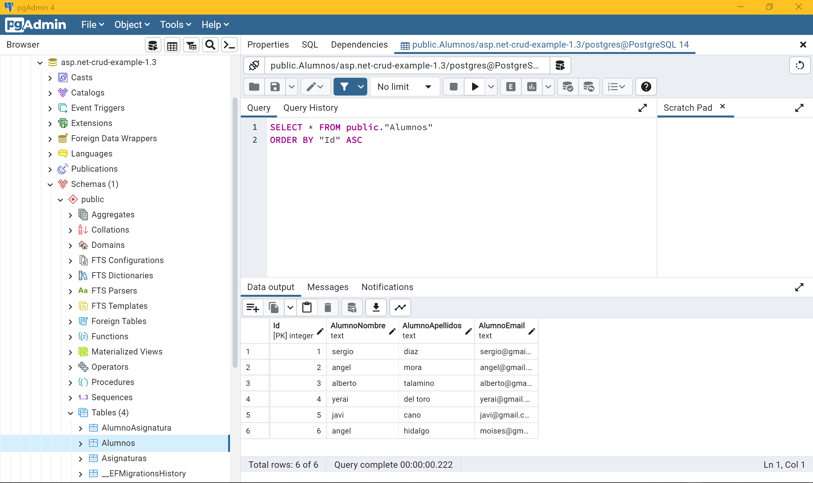

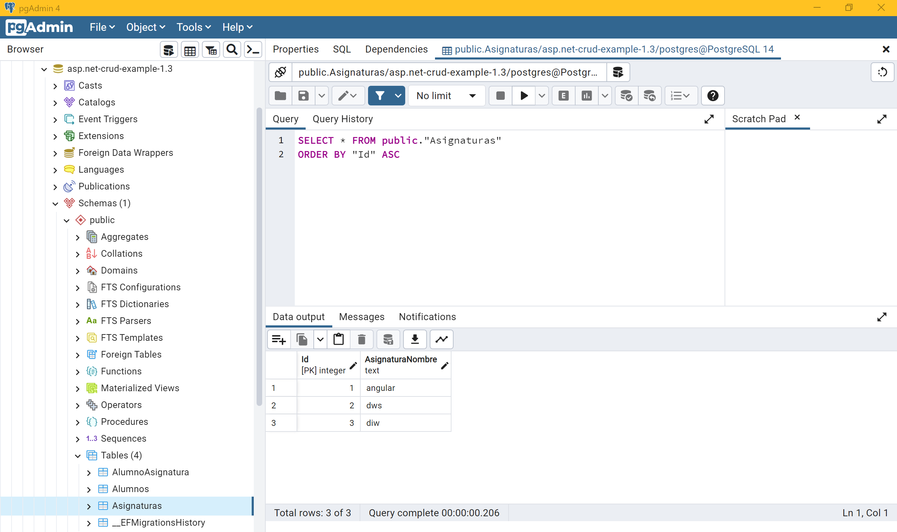

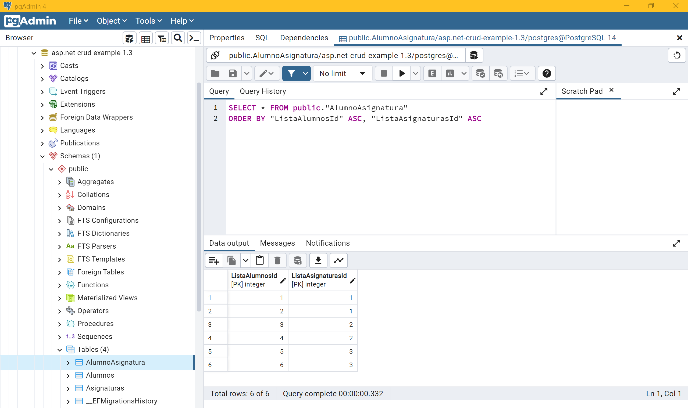